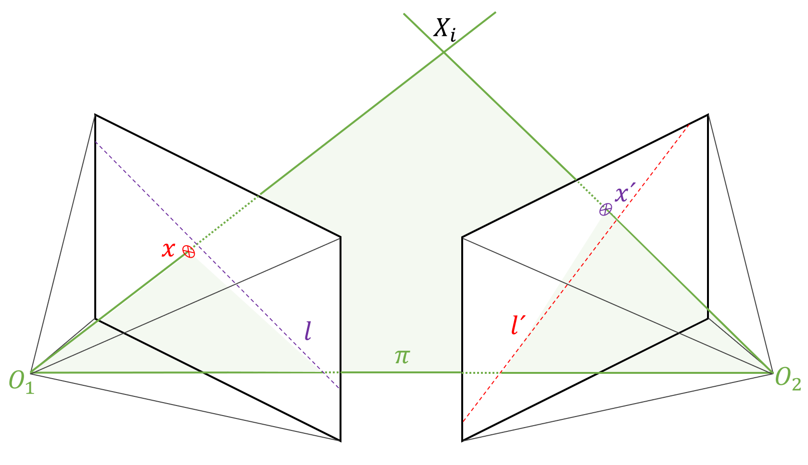
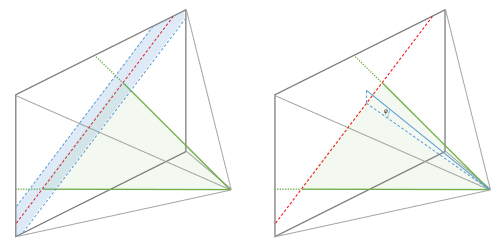
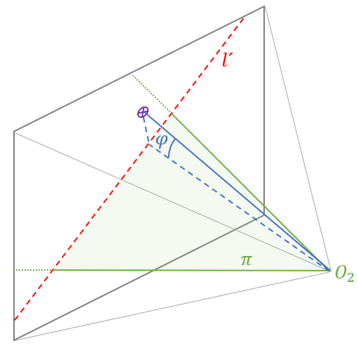
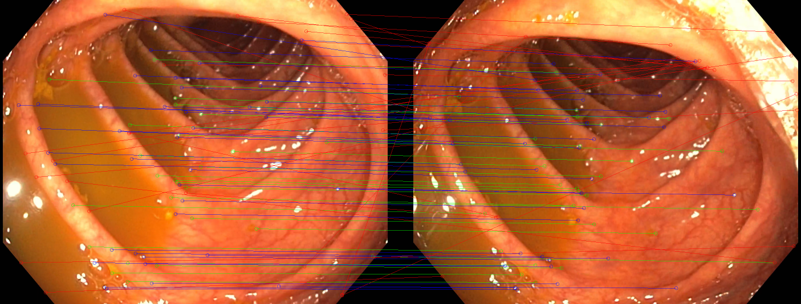
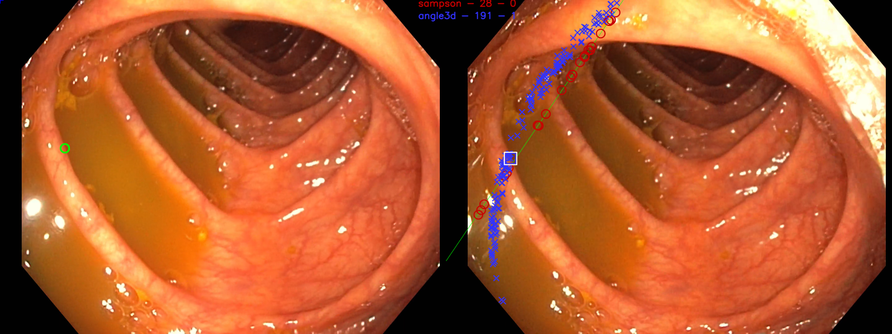
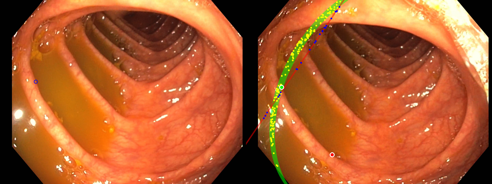
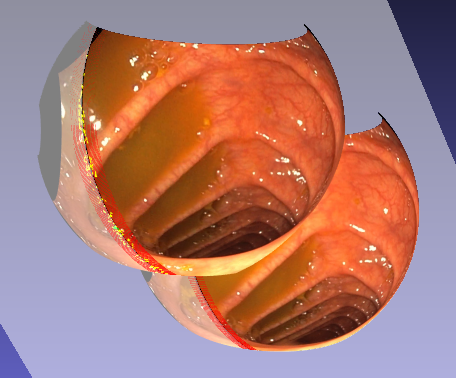
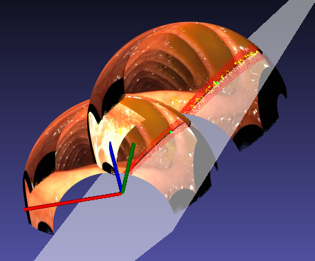
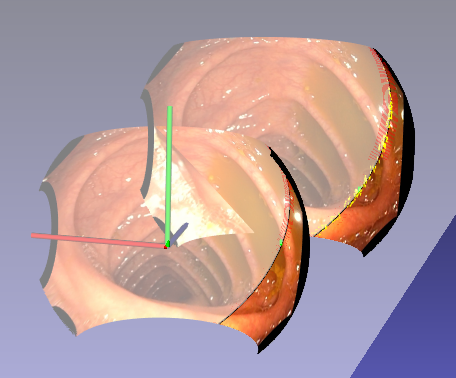

# Fish-Eye Matcher

Guided feature matching via angular error thresholding of angular error between candidate points and epipolar plane.

In epipolar geometry, the spatial relation between two images (Fundamental Matrix) can be used to project points from image 1 to image 2.
A projected point from image 1 ressults in a line in image 2.

In traditional epipolar matching algorithms, we use a previously computed Fundamental Matrix to project the points in image 1.
Then we define a search region along the line in image 2. We distort all the points in image 2 applying the camera model in place, and all distorted points within the search region are candidates to be a match to the original point.

We present a new implementation for the matching process applying epipolar geometry in a different manner. Instead of distorting the points, we'll compute a plane with the line and the camera center of the second image. Then we calculate lines by joining the camera center with the keypoints in camera 2. If the angle between this line and the previously computed plane is lesser than a pre-defined threshold, then the keypoint is a candidate for matching with the original one from camera 1.

## Test performed in main file

1. Camera parameters load from json file.
2. Load images.
3. Compute keypoints and descriptors.
4. Feature matching via BF, KNN or FLANN.
5. Compute Fundamental Matrix and epipolar lines.
6. Guided matching via Sampson distance and angular error thresholding.
7. Visualization.

## Results

By setting the threshold in the angular error, we can filter out the wrong matches.

Individual points can be compared, e.g., point 605 out of 8192 keypoints extracted, results in a match when using the angle thresholding, but not when using the traditional Sampson matching. The reason being that the epipolar plane, when interesected with the lens surface, automatically accounts for the distortion of the image. This is not the case when using the traditional method, and we'd need to dramatically increase the search region to match the result.

Th same result can be visualized in 3D, where we can display the 3D plane that contains both image centers, and the position of the candidate keypoint over the lens surface.

## Usage

All code and dependencies are compiled with Bazel for easier usage. 

Two binaries are available:

- In-depth point wise analysis:

    `bazel run //:main_ang_matcher_v0`

- 3D-viewer of lenses and epipolar plane for a single point:

    `bazel run //:main_fe_lens_matcher`

