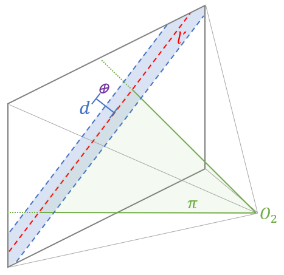

# Fish-Eye Matcher

Guided feature matching via angular error thresholding of angular error between candidate points and epipolar plane.

In epipolar geometry, the spatial relation between two images (Fundamental Matrix) can be used to project points from image 1 to image 2.
A projected point from image 1 ressults in a line in image 2.

In traditional epipolar matching algorithms, we use a previously computed Fundamental Matrix to project the points in image 1.
Then we define a search region along the line in image 2. We distort all the points in image 2 applying the camera model in place, and all distorted points within the search region are candidates to be a match to the original point.

We present a new implementation for the matching process applying epipolar geometry in a different manner. Instead of distorting the points, we'll compute a plane with the line and the camera center of the second image. Then we calculate lines by joining the camera center with the keypoints in camera 2. If the angle between this line and the previously computed plane is lesser than a pre-defined threshold, then the keypoint is a candidate for matching with the original one from camera 1.

